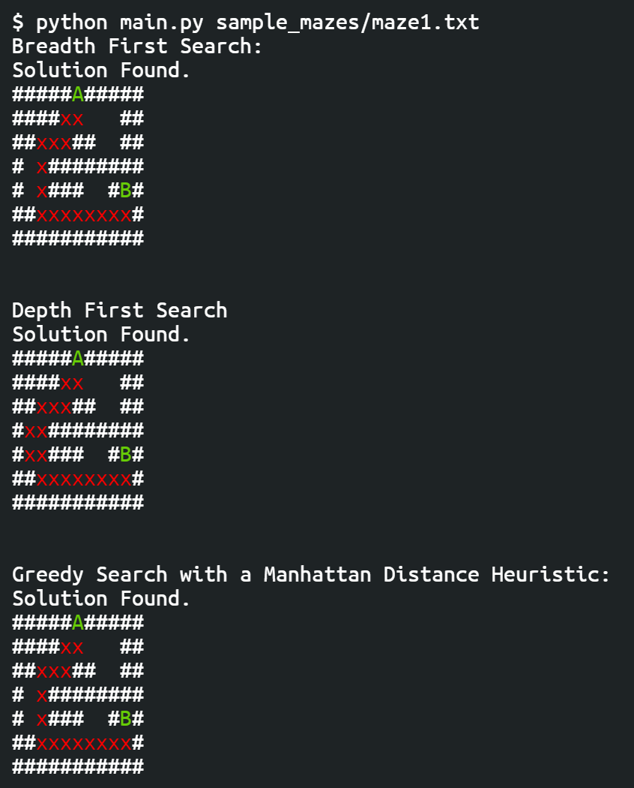

# Path Finding
Usage: python main.py _file_path_

## Requirements
- Your maze should be a _.txt_ file.
- Walls should be represented by a '#'.
- Squares that you can move into should be represented by a space.
- Somewhere in the top row of the maze should be a capital A, representing where to start.
- Somewhere in the maze should be a capital B, representing the end.
- You must have python installed.

## Usage
- If using the _Solve_ class ony one of: __depth, breadth and greedy__ should be set to True. This will be the type of Search algorithm the programme uses.
- The _draw\_solution_ function takes an optional argument _show\_explored_ which will show the states the nodes that had to be explored but weren't part of the solution in orange.

## Algorithms
### Depth First Search
- Depth First Search explores the deepest possible node and then backtracks if it arrives at a 'dead end'.
- It doesn't always produce the optimal solution.
- It makes use of a _Stack_ data structure.
### Breadth First Search
- Breadth First Search explores the shallowest possible node.
- It effectively tries all the possible paths from all the nodes it passes.
- It makes use of a _Queue_ data structure.
### Greedy
- Greedy Search makes use of a _heuristic_ to estimate the distance between a node and the end.
- The heuristic used in the programme is called _manhattan distance_.
- The manhattan distance between two points (a and b) is defined as |ax - bx| + |ay - by|.
- Using the heuristic, the node with the lowest manhattan distance (the one estimated to be closest to the end). 

## Example

